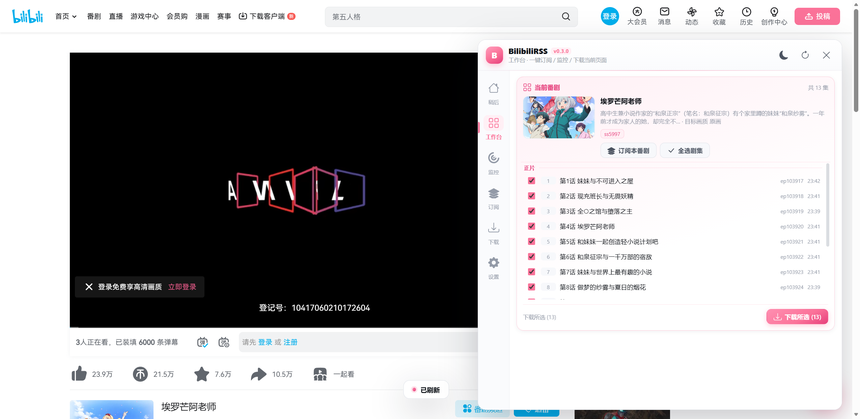
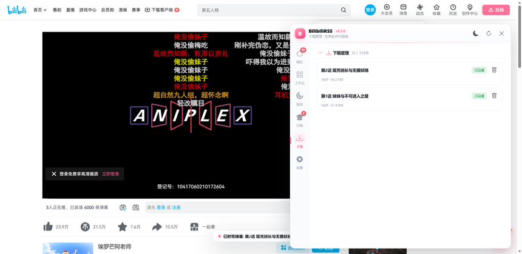
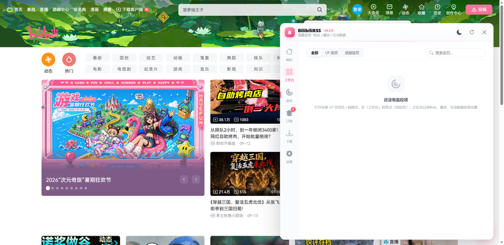
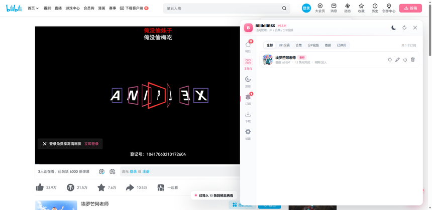
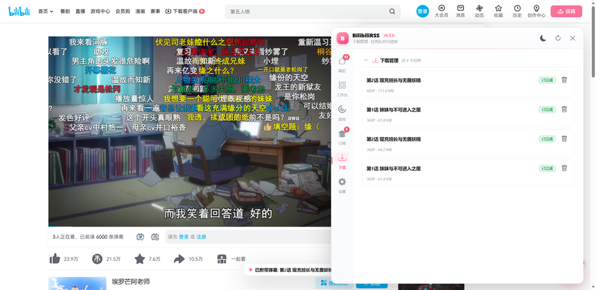
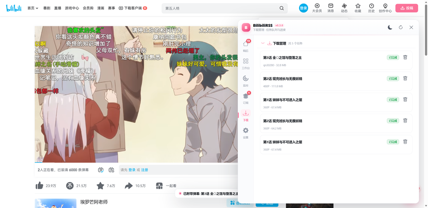

# BilibiliRSS

> 让 B 站自动帮你「收视频、追番、盯数据、下视频」的浏览器脚本 —— 数据全部存在你自己电脑上。

打开 B 站任意视频页或 UP 主页，屏幕右下角会出现一颗粉色悬浮球，点开就是一个小面板：**订阅追更、稍后再看、下载视频、数据监控**，四件事一站搞定。所有数据只保存在你的浏览器里。

---

## 它能帮你做什么

| 想做的事 | BilibiliRSS 怎么做 |
|---|---|
| **追 UP 主的更新** | 订阅后，UP 一发新视频就自动收进「稍后再看」列表，再也不用一个个翻 |
| **追一整部番** | 在番剧页一键订阅整季，全部剧集自动进列表，更到哪集收哪集 |
| **看长合集** | 订阅合集，更新自动跟进 |
| **收藏想看的视频** | 任意视频页一键入库，看完打勾，列表永远清爽 |
| **下载视频 / 番剧** | 从 360P 到原画都能下，还能连弹幕、封面一起带走 |
| **只要音频** | 一键只下音频文件（做铃声、听播客都方便） |
| **盯 UP 主的数据** | 粉丝、播放量涨了多少，每次刷新自动记录变化 |
| **换电脑不丢数据** | 一键导出 / 导入，所有订阅和列表随身带走 |

---

## 安装（只需三步）

1. **给浏览器装上 Tampermonkey 扩展**
   打开 [tampermonkey.net](https://www.tampermonkey.net/)，按照页面提示安装。或通过Chrome/Edge的扩展商店搜索 篡改猴 安装扩展。Chrome、Edge、Firefox 都支持。

2. **安装 BilibiliRSS 脚本**
   点这个链接，Tampermonkey 会自动弹出安装窗口，点「安装」即可：

   **[点我安装 BilibiliRSS](https://raw.githubusercontent.com/xinbaji/BilibiliRSS/main/BilibiliRSS.user.js)**

   > [!TIP]
   > 如果上面的链接打不开（网络原因），用这两招任选其一：
   > - 把链接开头的 `https://raw.githubusercontent.com` 换成 `https://gh-proxy.com/https://raw.githubusercontent.com` 再打开；
   > - 打开 [脚本文件](BilibiliRSS.user.js)，全选复制所有内容 → 点浏览器右上角 Tampermonkey 图标 → 「添加新脚本」→ 清空后粘贴 → `Ctrl+S` 保存。

3. **打开 B 站，找悬浮球**
   打开 [bilibili.com](https://www.bilibili.com) 的任意视频页，右下角出现粉色悬浮球就说明装好了。点它打开面板（快捷键 `Alt + B`）。

> [!NOTE]
> 建议先**登录 B 站账号**再使用：登录后能看高画质、下高清晰度；不登录也能用，但视频只能拿到 360P。

---

## 快速上手

### ① 订阅：让新视频自动送上门

**最省事的入口是「工作台」** —— 它会自动认出你当前所在的页面：

- 在 **UP 主空间页** → 显示 UP 信息，点「订阅该 UP」
- 在 **视频页** → 显示视频信息，可订阅 UP、也可只收藏这一条
- 在 **合集页 / 番剧页** → 显示完整目录，一键订阅全部

比如追一部番：打开番剧页 → 点悬浮球 → 工作台已经列出全部剧集（正片、主题曲分得清清楚楚）→ 点「订阅该番剧」。之后新更的每一集都会自动出现在「稍后」列表里。

> [!TIP]
> 订阅时可以设置**关键词**：比如只想收「教程」相关的投稿，填上关键词就只收带这个词的；也可以填「排除词」过滤掉不想要的。

### ② 稍后再看：你的追更清单

所有订阅的新内容都会堆在这里，看完一个处理一个：

- 每条带封面、时长、UP 名，点标题直接跳去观看
- 右侧按钮：**看完**（打勾移走）、**忽略**（不感兴趣）、**删除**
- 顶部能按状态筛选、按订阅来源筛选，还能搜标题
- 下载按钮就在卡片上，看到想留的直接下

### ③ 下载：把视频带走

两种方式，都很简单：

- **单条下载**：在「稍后」列表里点卡片上的下载按钮；
- **批量下载**：在工作台的列表里勾选要下的集数（支持全选），点「下载所选」。

「下载」页能看到每个任务的实时进度、画质和失败原因，失败可以重试。文件保存在**浏览器的默认下载文件夹**里。

**画质怎么选？** 在「设置 → 下载画质」里挑一个默认值（原画最高）。**登录 B 站后**画质才能拉满；没登录最高只有 360P。

大多数情况点完下载就完事了。少数高画质场景脚本会先分块下载再自动拼成一个 mp4，多等几秒即可——这个过程全自动，视频轨会开 8 个连接并行抢速度。

### ④ 监控：看看 UP 主数据涨了多少

在 UP 主页或视频页打开工作台，点「加监控」。之后每次打开面板都会记录并显示**变化量**：粉丝 +321、播放 +5.2万 这样一目了然。

### ⑤ 订阅页：统一管理

所有订阅集中在这里：暂停 / 恢复、改关键词、手动刷新、删除，还能按「UP 投稿 / 合集 / 分P视频 / 番剧」分类筛选。

### ⑥ 备份：换电脑不丢

「设置 → 数据」里一键导出全部数据（订阅、列表、监控、设置）为一个 JSON 文件，新电脑上导入即恢复。

---

## 下载设置怎么选

「设置」里有几个下载开关，按需打开（互斥的会自动帮你切）：

| 开关 | 打开后会怎样 |
|---|---|
| **附带弹幕文件** | 每个视频旁边多一份同名弹幕文件（`.xml`，可导入播放器看弹幕） |
| **附带封面文件** | 多存一张同名封面图，做合集封面、笔记配图很方便 |
| **音视频分离** | 不合并，直接得到画面、声音两个原始文件（自己剪视频用） |
| **仅下载音频** | 不要画面，只要一个 `.m4a` 声音文件（听播客、做铃声） |

> [!TIP]
> 「音视频分离」「仅下载音频」和「附带封面」可以随意组合，比如只下音频 + 封面，做播客归档刚刚好。

---

## 常见问题

<b>右下角没有悬浮球？</b>

确认两点：① Tampermonkey 已启用且 BilibiliRSS 是开启状态；② 当前页面是 B 站的视频页或 UP 空间页（首页列表页不注入）。首次安装后刷新一下页面。

<b>为什么画质最高只有 360P？</b>

没有登录 B 站。登录后画质即可解锁到 1080P / 原画（取决于你的账号权益）。脚本不会碰你的账号密码，登录是 B 站官方页面自己的事。

<b>下载怎么分两种「直接下载」和「合并」？</b>

B 站的片子给了两种规格：普通画质给的是整片文件，点完直接下载完成；高画质给的是画面、声音分开的流，脚本会并行下载后自动拼成一个 mp4——多花几秒，无需任何操作。

<b>番剧列表里为什么有「主题曲」？</b>

订阅整季会收录 OP / ED / 花絮等内容，列表里带角标区分。不想要的话，下载时不勾选它们即可；点条目会打开对应剧集页。

<b>下载的弹幕文件怎么用？</b>

`.xml` 弹幕文件可以导入 PotPlayer、mpv 等播放器看弹幕，或用弹幕转换工具做成 ASS 字幕。

<b>怎么更新脚本？</b>

Tampermonkey 会自动检查更新（设置里保持默认即可）。也可以随时到本页面下载最新的 `BilibiliRSS.user.js` 重新安装覆盖，数据不会丢。

<b>订阅会不会给 B 站服务器造成压力？</b>

不会。刷新是低频率增量的，脚本内置了去重和冷却，只在打开面板或到点时才请求一次。

---

## 隐私与说明

- **数据只在本机**：订阅、列表、设置全部存在浏览器扩展的本地存储里，脚本不含任何上传行为。
- **只读你的 B 站登录状态**：请求 B 站接口时浏览器自动带上你自己的 Cookie（和正常刷 B 站一样），脚本不记录、不转移任何凭据。
- **仅供个人学习研究使用**：下载功能请遵守 B 站用户协议，下载内容请勿传播或用于商业用途。
- 接口来自 B 站网页端，若某天 B 站改动导致功能失效，欢迎[提 Issue](https://github.com/xinbaji/BilibiliRSS/issues)。

## 更新日志

见 [CHANGELOG.md](CHANGELOG.md)。

## 许可证

[MIT](LICENSE) © xinbaji
